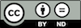

# La esperanto-kurso laŭ la Zagreba metodo

Tiu deponejo enhavas la Esperanto-kurson laŭ la [Zagreba metodo](https://eo.wikipedia.org/wiki/Zagreba_metodo) en strukturita datumaranĝo. Do, la kompleta enhavo estas konservita per [YAML](https://en.wikipedia.org/wiki/YAML)-dosieroj, facile legeblaj per diversaj komputilaj programlingvoj – kaj ankaŭ por homoj.

Tiel oni facile kaj rapide povos krei eldonaĵojn de la kurso en HTML, EPUB, PDF aŭ ia ajn formo.

## Demonstraĵo

- http://learn.esperanto.com/

## Permesiloj

Tiun ĉi kurson oni povas libere uzi, kondiĉe ke oni nomas la [aŭtorojn](AUTHORS.md).

### Esperantaj tekstoj

 

La esperantaj leciontekstoj en la kurso `enhavo/netradukenda/tekstoj` devas resti neŝanĝitaj. Tial aplikas la [CC BY-ND 4.0](enhavo/netradukenda/tekstoj/PERMESILO.md).

### Aliaj dosieroj

Ĉion alian oni povas ŝanĝi. Tial aplikas la [CC BY 4.0](PERMESILO.md).

## Pliaj tradukoj?

Ĉu vi volas traduki la kurson al nova lingvo? Belege! Bonvole [plulegu tie](enhavo/tradukenda).
